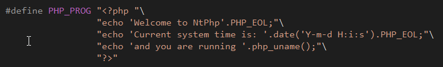
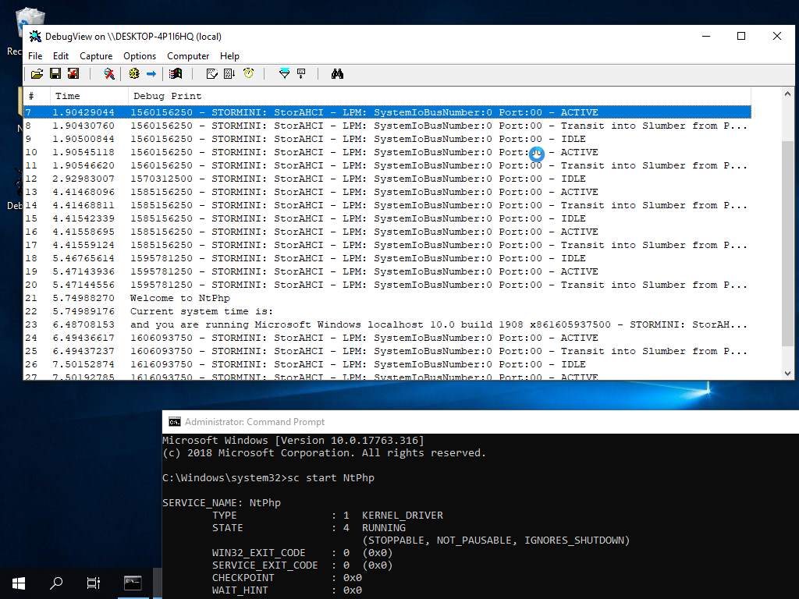

# NtPhp

Ever wanted to execute PHP in your kernel driver? Look no further!

Relevant [code](https://github.com/mrexodia/NtPhp/blob/f99e739fa7083fd124368756491ca55ca2cf6005/NtPhp/Driver.c#L26):

Execution:

